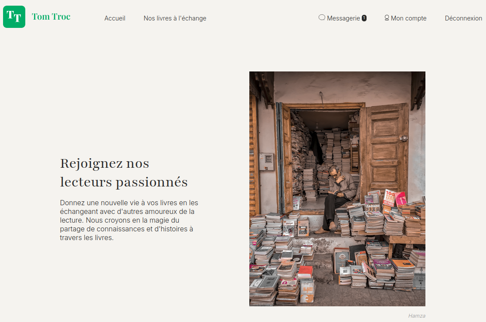
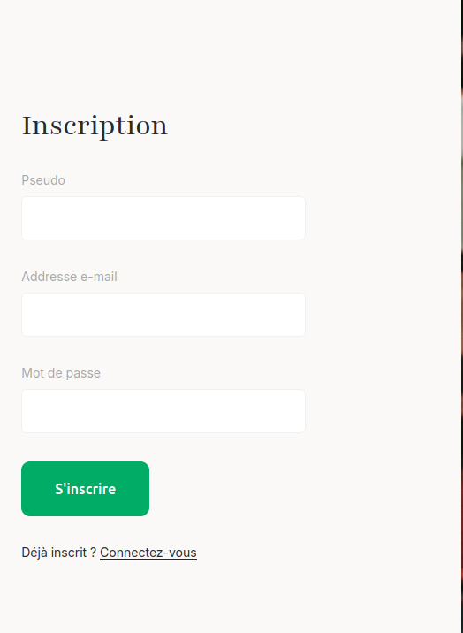
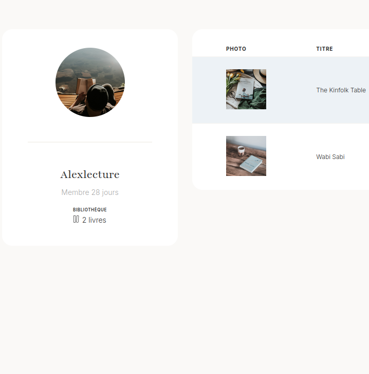
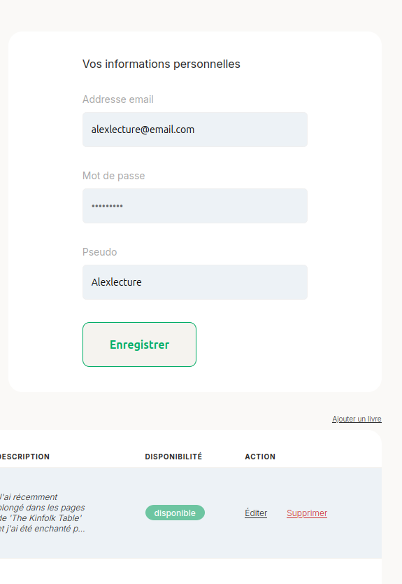
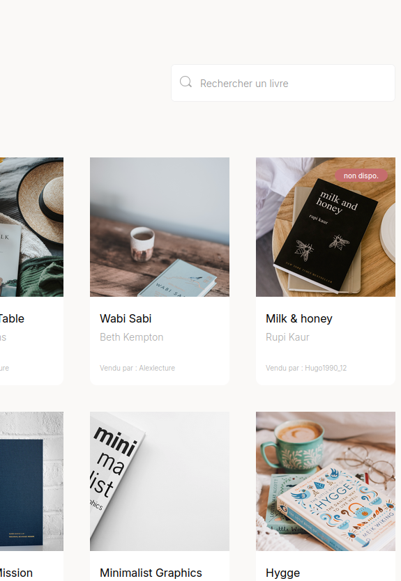
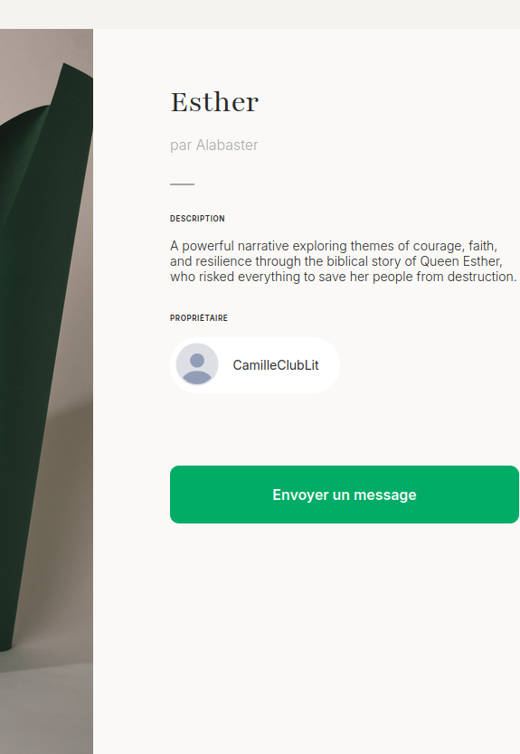
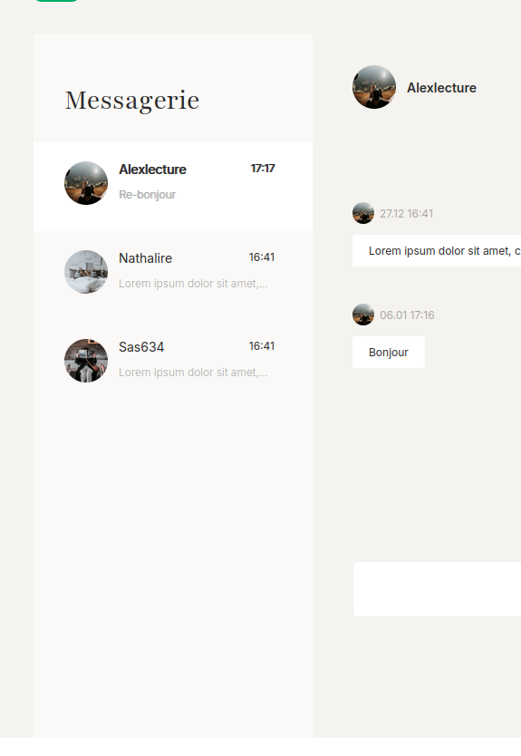

# Projet 4

## TomTroc

### _OpenClassrooms_

_Par André M._

---

## Contexte

Ce projet consiste à développer le MVP (Minimum Viable Product) de la plateforme **TomTroc** permettant aux utilisateurs de partager des livres.

- **Objectif** : utiliser une architecture Modèle-Vue-Contrôleur (MVC)

---

## Fonctionnalités Implémentées (V1)

### 1. Inscription et Connexion des membres

- Les utilisateurs peuvent s'inscrire directement
- Pas de validation par mail ou administrateur
- Connexion possible après inscription

---

### 2. Page de profil des utilisateurs

- Consultation des profils des autres utilisateurs
- Pas de pages listant l’intégralité des utilisateurs
- Modification du profil personnel voir _("Mon compte")_

---

### 3. Bibliothèque personnelle ("Mon compte")

- Création d'une bibliothèque personnelle
- Chaque livre possède :
  - Un titre
  - Un auteur (champ texte pour V1)
  - Une image (facultatif)
  - Une description (texte long)
  - Un statut de disponibilité (disponible à l'échange ou non)

---

### 4. Page "Nos livres à l'échange"

- Consultation des livres disponibles à l'échange
- Champ de recherche (filtrage par titre pour la V1)

---

### 5. Détail d'un livre

- Affichage des détails d'un livre
- Lien vers le profil du propriétaire
- Lien pour envoyer un message au propriétaire

---

### 6. La messagerie

- Consultation de la liste des messages reçus.
- Visualisation d'un fil de discussion.
- Envoi et réponse aux messages.
- Fonctionnalités de base pour V1 (pas de mise en forme requise).

---

## Architecture du projet

- [**`public/index.php`**](https://github.com/nutbreaker/projet_4_b/blob/main/public/index.php) : point d'entrée unique de l'application
-  [**`public/`**](https://github.com/nutbreaker/projet_4_b/tree/main/public) : contient les `css`, `images` et `templates`
- [**`src/controllers/`**](https://github.com/nutbreaker/projet_4_b/tree/main/src/controllers) : logique métier de l'application
- [**`src/models/`**](https://github.com/nutbreaker/projet_4_b/tree/main/src/models) : les entités de l'application
- [**`src/repositories/`**](https://github.com/nutbreaker/projet_4_b/tree/main/src/repositories) : gèrent l'accès aux données
- [**`src/services/`**](https://github.com/nutbreaker/projet_4_b/tree/main/src/services) :  logique technique de l'application
- [**`src/utils/`**](https://github.com/nutbreaker/projet_4_b/tree/main/src/utils) : classes utilitaires
- [**`database/`**](https://github.com/nutbreaker/projet_4_b/tree/main/database) : contient la base de données
- [**`config/`**](https://github.com/nutbreaker/projet_4_b/tree/main/config) : contient le fichier autoload.php

---

## Roadmap possible pour la V2

- Créer un conteneur de dépendances
  - **Avantage** réduit le code d'initialisation de `index.php`
  - **Inconvénient** rend le code moins explicite
- Améliorer le chat grâce à un SSE pour plus d'interactivité
- Améliorer la recherche en utilisant le full text search offert par SQLite
- Ajouter des tests unitaires
- Demander au designer d'améliorer le contraste des _cartes_
- Ajouter un espace d'administration de l'application

---

## Conclusion

**TomTroc** est prêt à accueillir ses premiers utilisateurs.
